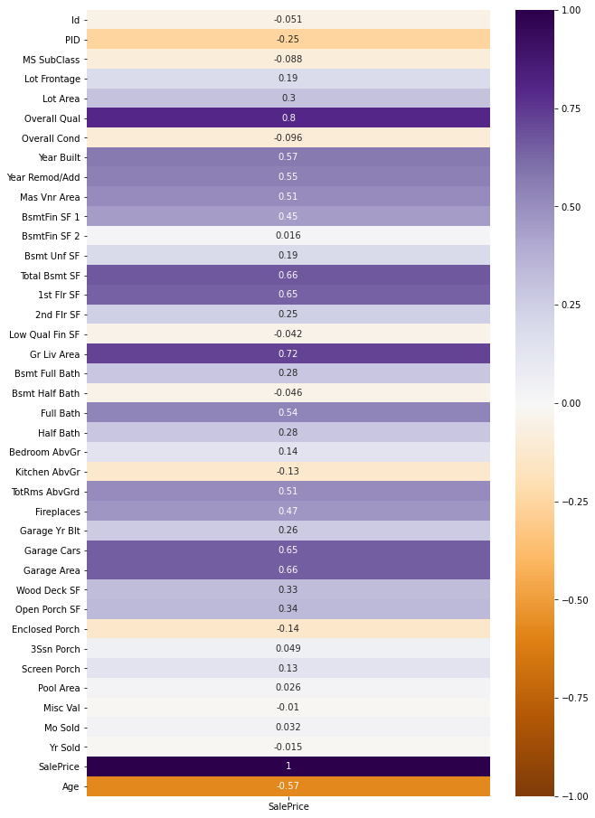
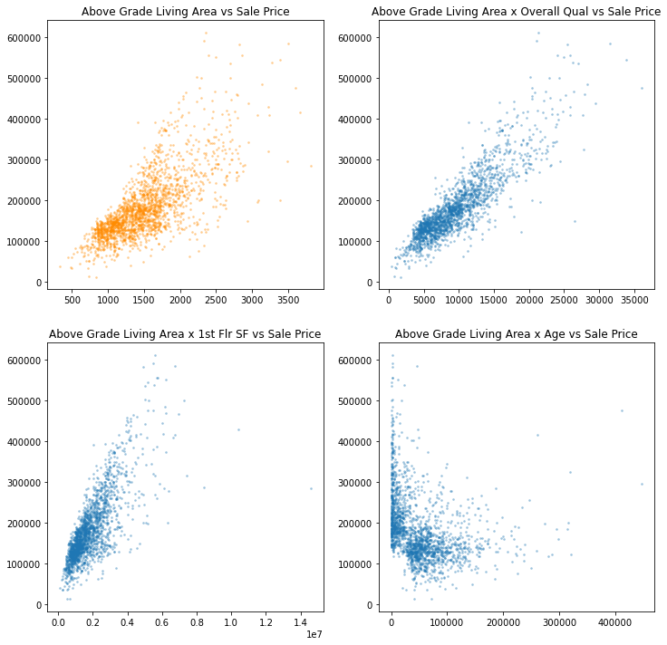

# Project 2 - Ames Housing Data

-----

### Contents

- [Problem Statement](#Problem_Statement)
- [Executive Summary](#Executive_Summary)
- [Notebooks](#Notebooks)
- [Data Dictionary](#Data_Dictionary)
- [Conclusions](#Conclusions)

-----

# Problem Statement

-----
    
Housing is an important part of any economy. Being able to get a good estimate on the value of a home is the first step to making good decisions about buying and selling a house. Common wisdom is that bigger houses are worth more money, and this is generally a good rule of thumb. But even within the same city, one two-thousand-square-foot house may cost much more or less than another. We know that location, age, and condition are all important factors, but how do we get an accurate estimate on how these factors affect home prices? In addition, there could be any number of variables that affect the final sale price. With detailed data on home sales in Ames, Iowa, we aim to take the mystery out of home prices by fitting a multiple linear regression model to test a large number of featues for correlation with home sales. With this information, we will train the model on the most predictive data features so that we can make better estimates of final sale prices.
    
-----

# Executive Summary

-----

Data from Ames, Iowa homes sales was split into two categories: Trianing and Testing. The Training data was used to train a model to predict sales from the Testing data, which was used to score the model using Root Mean Squared Error (RMSE) as a metric for evaluation.

Initial analysis revealed a handful of columns and a couple of rows with several null values. There were fewer columns with null values in the Testing data, though this data had a couple of special cases that had to be accounted for when cleaning. Cleaning the data consisted of defining a function to handle null values and special cases, in most cases replacing the null value with the data value signifying that the feature does not exist for that house. In some cases, it was likely or necessary that the feature did exist, and in these cases a best guess was made as to the correct value - either the most logical or most common choice. In the testing data, some rows were dopped, as these were either missing large amounts of data, or were such outliers that the data seemed suspet - or were such unusual circumstances that the data was not useful for modeling. No rows were dropped from the testing data, because it was necessary to keep this data intact for testing predictions.

Below are two images created in the exploratory analysis stage. First is a correlation heatmap between the cleaned data's numeric columns and the sale prices of the homes. This visualization is a good overview of which features may be better predictors of final sale price. From these key features, interactions were explored via a function written to visually compare data and its interactions against sale price. After identifying important features and useful interactions, new features were created and the modeling process began.

The engineered features of Total Square Footage, its interaction with Overall Quality, Total Porch Size, and Log(Age) were the initial features used to begin the modelling process. These features proved to be very useful, with intial models achieving r^2 scores of 0.87 with similar, and consistent, cross validation scores. Thanks to functions that I wrote to automate the fitting and scoring processes, different features and dummy variables could quickly be compared. I attempted a broad, overfit, model to perform regularization on, however the results did not improve prediction when the Testing data was used to predict prices.

For the final iteration, an algorithm was used to select the dummy variables for a well fit model that would hopefully do well with regularization. For this selection, a model was fit using only categorical values as features. Features which had p-values lower than 0.5 were included in the final selection of categorical dummy variable. The intent of using this value was to include enough predictive data to fit the training data well, without fitting too much noise.

Inital results from this model had r^2 scores of over 0.94 but showed some variability in train test splits and cross validation. Both LASSO and Ridge fits were optimized and resulted in scores of over .93, with Ridge performing slightly better than LASSO. The RMSE of the final model was 20,600 on Training data and 24,400 on Testing Data. The difference in error between this final model and a basic model using only Total Sqaure Feet as a feature is shown below.

# Notebooks

#### 01 - Initial EDA

- Basic information on raw data, including datatypes, null values, and simple histograms plots.

#### 02 - Data Cleaning

- Functions to remove null values from data sets and handle special cases. Write new CSV files for use in analysis and engineering.

#### 03 - EDA

- In-depth Exploratory Data Analysis. Functions to compare multiple plots, along with comparison of feature interaction. Exploratory modeling to analyze categorical features and determine which features are likely to be most useful in models.

#### 04 - Feature Engineering

- Functions to add new columns to dataframes for feature interactions, along with creation of new columns like Log(Age). Writes new CSV files for use in models.

#### 05 - Modeling

- Iterative model design, starting with simple numerical-feature-based regression and adding more complexity, then using regularization to try to decrease variability. Has functions for quickly testing different features with TTS and CV scores. Writes new CSV files for use in vizualizations.

### 06 - Visualizations

- Contains code used to create seaborn visualizations used in this README and in the slides presentation.

# Data Dictionary
 ----
 
 A description of columns in the data can be found here:
 
 https://www.kaggle.com/c/dsir-720-project-2-regression-challenge/data
 
 ----
 
 # Conclusions
 
 ----
 
 With good feature selection, it was possible to improve the predictive capabilites of a linear regression model. The r^2 and RMSE of the final model were noticable improvements over simple, straightforward models. While some of the data is qualitative in nature, it is important to include that qualitative analysis. Home prices are ultimately decided by how much a human, not a machine, thinks the home is worth. There will always be error when predicting outcomes involving the behavior of people, so the performance of the model may be difficult to improve.
 
 More descriptive data could help to improve the model. If there were more information on home features that influence buyer's decisions, such as home layout, interior quality, or better quality category options, the model may improve. More data is needed on home sales in many neighborhoods in order to accurately predict the effect of those locations on home sales. Several SubClass categories were also lacking in data, and most sales were in just two of these categories. A larger dataset spanning more time could give more information on these catergories, but could also introduce new error due to changes in trends as buyers favor different kinds of homes and features.